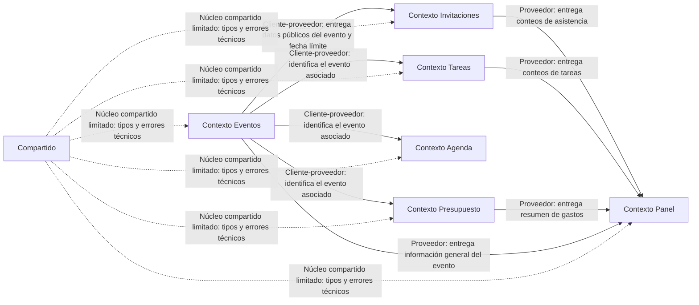

# Contextos delimitados y propiedad de datos

## Propósito

Este documento define los contextos delimitados de EnAgenda, sus relaciones y la
propiedad de los datos principales. El objetivo es que cada entidad tenga un único
módulo responsable de modificarla y que los demás módulos accedan a ella mediante
servicios o contratos explícitos.

EnAgenda se implementa como un monolito modular. Los contextos están separados
dentro de la misma aplicación, pero no se despliegan como servicios independientes.

## Contextos delimitados

| Contexto | Responsabilidad | Estado actual |
|---|---|---|
| Eventos | Gestionar la información principal del evento: nombre, fecha, lugar y fecha límite de respuesta. | Planificado |
| Invitaciones | Gestionar invitados, enlaces individuales, tokens, vigencia y estados de asistencia. | Implementado parcialmente |
| Tareas | Gestionar tareas asociadas a un evento y su estado de cumplimiento. | Planificado |
| Agenda | Gestionar actividades, horarios y orden del evento. | Planificado |
| Presupuesto | Gestionar elementos necesarios, gastos y valores asociados al evento. | Planificado |
| Panel | Consultar y resumir indicadores de eventos, invitaciones, tareas y presupuesto. No modifica datos operativos. | Planificado |
| Compartido | Contener tipos, errores y utilidades técnicas transversales. No contiene reglas de negocio de los contextos. | Inicial |

## Mapa de contextos

## Relaciones tipificadas

| Proveedor | Cliente | Tipo de relación | Información intercambiada | Regla |
|---|---|---|---|---|
| Eventos | Invitaciones | Cliente-proveedor | Identificador del evento, fecha límite y datos públicos permitidos | Invitaciones no modifica la información principal del evento. |
| Eventos | Tareas | Cliente-proveedor | Identificador del evento | Tareas administra únicamente sus propias tareas. |
| Eventos | Agenda | Cliente-proveedor | Identificador del evento | Agenda administra únicamente actividades y horarios. |
| Eventos | Presupuesto | Cliente-proveedor | Identificador del evento | Presupuesto administra únicamente elementos y gastos. |
| Eventos | Panel | Proveedor-consumidor | Información general del evento | Panel solo consulta y resume. |
| Invitaciones | Panel | Proveedor-consumidor | Conteos de estados de asistencia | Panel no modifica invitaciones ni respuestas. |
| Tareas | Panel | Proveedor-consumidor | Conteos de tareas pendientes y completadas | Panel no modifica tareas. |
| Presupuesto | Panel | Proveedor-consumidor | Total de gastos y elementos | Panel no modifica gastos ni elementos. |
| Compartido | Todos los contextos | Núcleo compartido limitado | Tipos, errores y utilidades técnicas mínimas | No contiene entidades ni reglas de negocio de Eventos, Invitaciones, Tareas, Agenda, Presupuesto o Panel. |

## Capa anticorrupción

En la versión actual no existen sistemas externos integrados. Por ello, no se
implementa todavía una capa anticorrupción.

Si en el futuro EnAgenda se integra con un proveedor externo, por ejemplo un
servicio de calendario, correo o pagos, la integración se realizará mediante un
adaptador propio del contexto que la requiera. Ese adaptador evitará que modelos o
formatos externos se propaguen hacia los demás contextos.

## Propiedad de datos y permisos

| Entidad o dato | Contexto dueño | Otros contextos que pueden consultar | Actor autorizado para modificarlo |
|---|---|---|---|
| Evento | Eventos | Invitaciones, Tareas, Agenda, Presupuesto y Panel | Propietario del evento |
| Fecha límite de respuesta | Eventos | Invitaciones | Propietario del evento |
| Invitación | Invitaciones | Panel | Propietario del evento |
| Token de invitación | Invitaciones | Ninguno directamente | El sistema lo genera; el propietario puede regenerarlo si se define esa función |
| Estado de asistencia | Invitaciones | Panel | Invitado, mientras el enlace esté vigente |
| Tarea | Tareas | Panel | Propietario del evento |
| Actividad de agenda | Agenda | Panel, si requiere mostrar un resumen | Propietario del evento |
| Elemento necesario | Presupuesto | Panel | Propietario del evento |
| Gasto | Presupuesto | Panel | Propietario del evento |
| Indicadores del panel | Panel | Ninguno | El sistema los calcula; el propietario solo los consulta |

## Cobertura frente al código actual

Actualmente, el único contexto con entidad y repositorio implementados es
Invitaciones. La entidad `Invitacion` y su repositorio en memoria se encuentran
en el módulo `src/invitaciones/`.

Los contextos Eventos, Tareas, Agenda, Presupuesto y Panel están definidos como
límites arquitectónicos y se implementarán progresivamente en los siguientes
aspectos. Sus entidades todavía no deben declararse como implementadas en código.

## Verificación de violaciones de propiedad

Se revisaron los módulos actuales mediante búsqueda de escrituras y referencias
a entidades de dominio.

| Verificación | Resultado | Evidencia |
|---|---|---|
| Escrituras sobre la entidad `Invitacion` fuera de `src/invitaciones/` | No se detectaron violaciones | La creación y actualización de invitaciones se concentra en el módulo Invitaciones. |
| Escrituras desde Panel sobre invitaciones, tareas o gastos | No aplica todavía; Panel no está implementado | El contexto Panel se mantendrá como consumidor de resúmenes. |
| Entidades de negocio ubicadas en `src/compartido/` | No se detectaron violaciones | Compartido solo debe contener utilidades técnicas o tipos transversales. |
| Acceso directo a repositorio de invitaciones desde otro contexto | No se detectaron violaciones en el estado actual | El repositorio en memoria pertenece a `src/invitaciones/infraestructura/`. |

## Plan de corrección

Actualmente no se detectaron violaciones de propiedad sobre el código existente.
Por ello, no hay correcciones activas.

Si se detecta una violación, se aplicará el siguiente plan:

| Tipo de violación | Acción correctiva | Responsable |
|---|---|---|
| Un contexto modifica una entidad de otro contexto | Mover la operación al contexto dueño y exponer un servicio o contrato explícito. | Equipo del módulo afectado |
| Panel modifica datos operativos | Eliminar la escritura del Panel y delegarla al contexto dueño. | Equipo del módulo Panel |
| Entidad de negocio ubicada en Compartido | Mover la entidad al contexto dueño y dejar en Compartido solo tipos o utilidades técnicas. | Equipo del módulo afectado |
| Integración externa filtra su modelo hacia el dominio | Crear un adaptador o capa anticorrupción dentro del contexto que consume la integración. | Equipo del contexto integrador |