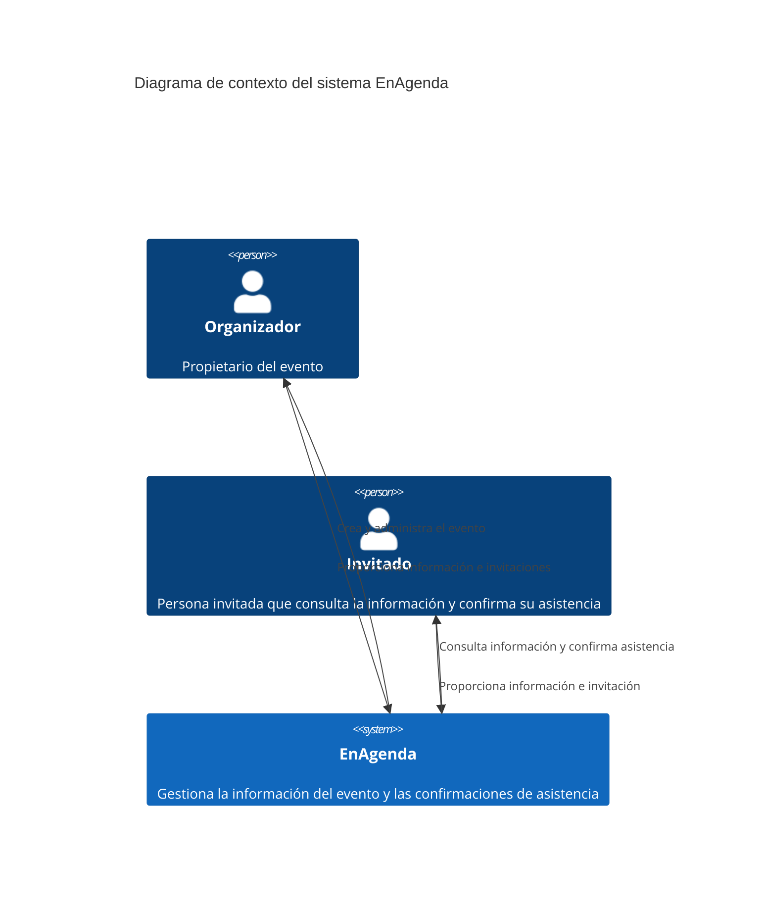

# C4 - Nivel 1: Contexto

# Contexto y alcance

## Contexto de negocio

EnAgenda permite a un organizador centralizar la información operativa de un
evento pequeño. El organizador administra el evento, los invitados, las tareas,
la agenda, los elementos requeridos y un presupuesto básico.

Los invitados acceden mediante un enlace individual. No requieren crear una
cuenta para consultar la información permitida del evento y registrar o
actualizar su respuesta de asistencia.

## Alcance inicial

El MVP incluye:

- Creación y edición de eventos.
- Registro de invitados.
- Generación de enlaces individuales de invitación.
- Consulta y actualización de respuestas de asistencia.
- Gestión básica de tareas.
- Registro de elementos necesarios.
- Agenda básica.
- Presupuesto básico.
- Panel de seguimiento.

El MVP no incluye inicialmente pagos, chat entre participantes, sincronización
con calendarios externos, notificaciones push, integración con redes sociales ni
manejo de datos reales de terceros.

## Interfaces externas

En esta etapa no se han definido sistemas externos obligatorios. La interacción
externa del MVP ocurre directamente entre los usuarios y EnAgenda mediante una
interfaz web protegida con HTTPS.
