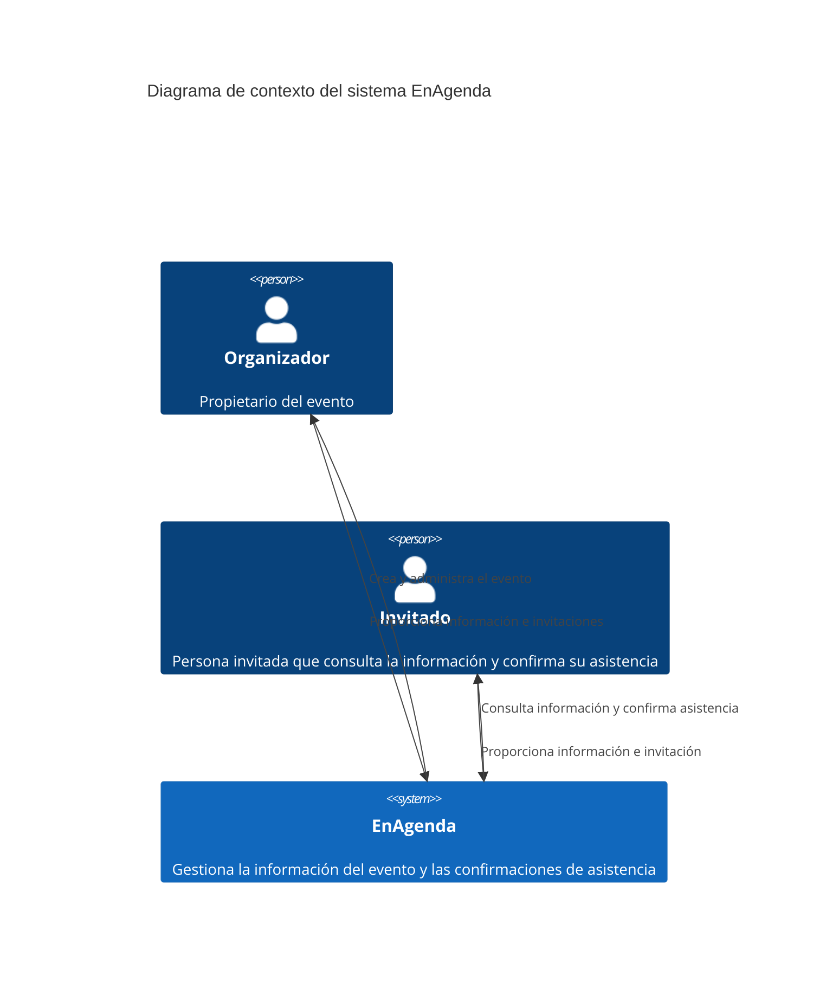

# C4 - Nivel 1: Contexto

```mermaid
C4Context

    title Diagrama de contexto del sistema EnAgenda

    Person(Organizador, "Organizador", "Propietario del evento")
    Person(Invitado, "Invitado", "Persona invitada que consulta la información y confirma su asistencia")

    System(EnAgenda, "EnAgenda", "Gestiona la información del evento y las confirmaciones de asistencia")

    Rel(Organizador, EnAgenda, "Crea y administra el evento")
    Rel(EnAgenda, Organizador, "Proporciona información e invitaciones")

    Rel(Invitado, EnAgenda, "Consulta información y confirma asistencia")
    Rel(EnAgenda, Invitado, "Proporciona información e invitación")

    UpdateLayoutConfig($c4ShapeInRow="3", $c4BoundaryInRow="1")
    UpdateRelStyle(Organizador, EnAgenda, $offsetY="-20")
    UpdateRelStyle(EnAgenda, Organizador, $offsetY="20")
    UpdateRelStyle(Invitado, EnAgenda, $offsetY="-20")
    UpdateRelStyle(EnAgenda, Invitado, $offsetY="20")
```
