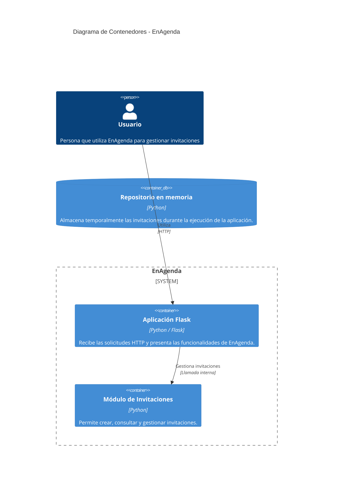

# C4 - Nivel 2: Contenedores

```mermaid
C4Container
    title Diagrama de Contenedores - EnAgenda

    Person(usuario, "Usuario", "Persona que utiliza EnAgenda para gestionar invitaciones")

    System_Boundary(enagenda, "EnAgenda") {

        Container(webApp, "Aplicación Flask", "Python / Flask", "Recibe las solicitudes HTTP y presenta las funcionalidades de EnAgenda.")

        Container(invitaciones, "Módulo de Invitaciones", "Python", "Permite crear, consultar y gestionar invitaciones.")

    }

    ContainerDb(repositorio, "Repositorio en memoria", "Python", "Almacena temporalmente las invitaciones durante la ejecución de la aplicación.")

    Rel(usuario, webApp, "Utiliza", "HTTP")
    Rel(webApp, invitaciones, "Gestiona invitaciones", "Llamada interna")
```
