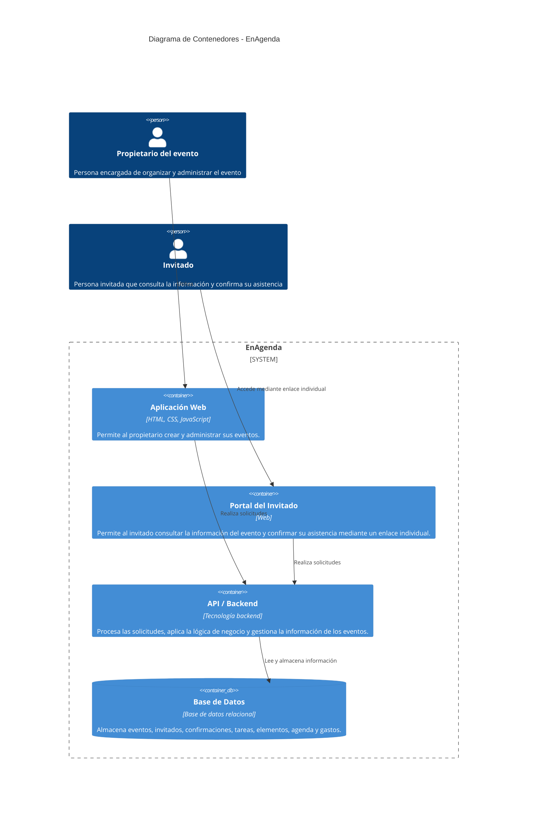

# C4 - Nivel 2: Contenedores

```mermaid
C4Container
    title Diagrama de Contenedores - EnAgenda

    Person(organizador, "Propietario del evento", "Persona encargada de organizar y administrar el evento")
    Person(invitado, "Invitado", "Persona invitada que consulta la información y confirma su asistencia")

    System_Boundary(enagenda, "EnAgenda") {

        Container(webApp, "Aplicación Web", "HTML, CSS, JavaScript", "Permite al propietario crear y administrar sus eventos.")

        Container(portalInvitado, "Portal del Invitado", "Web", "Permite al invitado consultar la información del evento y confirmar su asistencia mediante un enlace individual.")

        Container(api, "API / Backend", "Tecnología backend", "Procesa las solicitudes, aplica la lógica de negocio y gestiona la información de los eventos.")

    ContainerDb(database, "Base de Datos", "Base de datos relacional", "Almacena eventos, invitados, confirmaciones, tareas, elementos, agenda y gastos.")

    }


    Rel(organizador, webApp, "Utiliza")
    Rel(invitado, portalInvitado, "Accede mediante enlace individual")

    Rel(webApp, api, "Realiza solicitudes")
    Rel(portalInvitado, api, "Realiza solicitudes")
    Rel(api, database, "Lee y almacena información")
```
