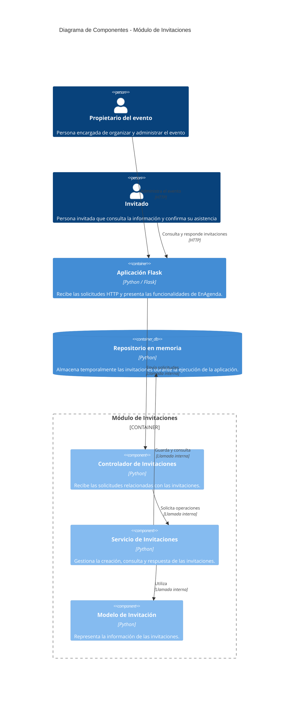

# C4 - Nivel 3: Componentes

```mermaid
C4Component

    title Diagrama de Componentes - Módulo de Invitaciones

    Person(organizador, "Propietario del evento", "Persona encargada de organizar y administrar el evento")
    Person(invitado, "Invitado", "Persona invitada que consulta la información y confirma su asistencia")

    Container(webApp, "Aplicación Flask", "Python / Flask", "Recibe las solicitudes HTTP y presenta las funcionalidades de EnAgenda.")

    Container_Boundary(invitaciones, "Módulo de Invitaciones") {

        Component(controlador, "Controlador de Invitaciones", "Python", "Recibe las solicitudes relacionadas con las invitaciones.")

        Component(servicio, "Servicio de Invitaciones", "Python", "Gestiona la creación, consulta y respuesta de las invitaciones.")

        Component(modelo, "Modelo de Invitación", "Python", "Representa la información de las invitaciones.")

    }

    ContainerDb(repositorio, "Repositorio en memoria", "Python", "Almacena temporalmente las invitaciones durante la ejecución de la aplicación.")

    Rel(organizador, webApp, "Administra el evento", "HTTP")
    Rel(invitado, webApp, "Consulta y responde invitaciones", "HTTP")

    Rel(webApp, controlador, "Envía solicitudes", "Llamada interna")

    Rel(controlador, servicio, "Solicita operaciones", "Llamada interna")
    Rel(servicio, modelo, "Utiliza", "Llamada interna")
    Rel(servicio, repositorio, "Guarda y consulta", "Llamada interna")

    UpdateLayoutConfig($c4ShapeInRow="3", $c4BoundaryInRow="1")

    UpdateRelStyle(organizador, webApp, $offsetY="-20")
    UpdateRelStyle(invitado, webApp, $offsetY="-20")
    UpdateRelStyle(webApp, controlador, $offsetY="-20")
```

