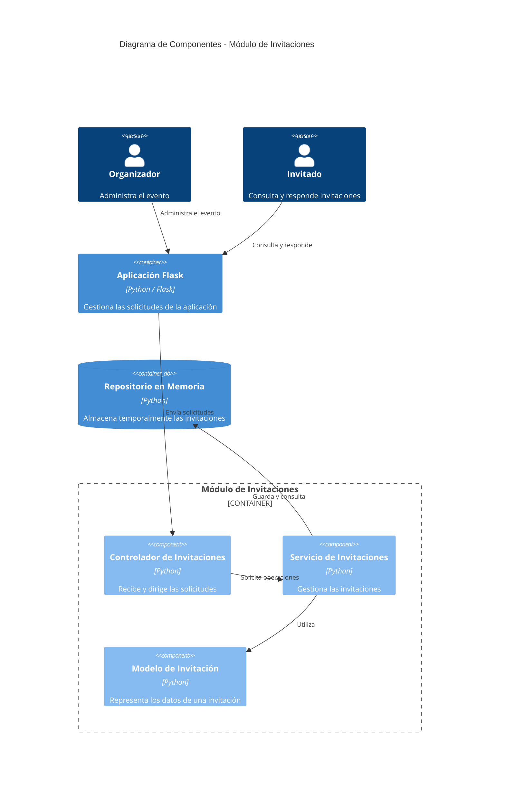

# C4 - Nivel 3: Componentes

```mermaid
C4Component
    title Diagrama de Componentes - Módulo de Invitaciones

    Person(organizador, "Organizador", "Administra el evento")
    Person(invitado, "Invitado", "Consulta y responde invitaciones")

    Container(webApp, "Aplicación Flask", "Python / Flask", "Gestiona las solicitudes de la aplicación")

    Container_Boundary(invitaciones, "Módulo de Invitaciones") {
        Component(controlador, "Controlador de Invitaciones", "Python", "Recibe y dirige las solicitudes")
        Component(servicio, "Servicio de Invitaciones", "Python", "Gestiona las invitaciones")
        Component(modelo, "Modelo de Invitación", "Python", "Representa los datos de una invitación")
    }

    ContainerDb(repositorio, "Repositorio en Memoria", "Python", "Almacena temporalmente las invitaciones")

    Rel(organizador, webApp, "Administra el evento")
    Rel(invitado, webApp, "Consulta y responde")

    Rel(webApp, controlador, "Envía solicitudes")
    Rel(controlador, servicio, "Solicita operaciones")
    Rel(servicio, modelo, "Utiliza")
    Rel(servicio, repositorio, "Guarda y consulta")

    UpdateLayoutConfig($c4ShapeInRow="3", $c4BoundaryInRow="1")

    UpdateRelStyle(organizador, webApp, $offsetY="-30")
    UpdateRelStyle(invitado, webApp, $offsetY="30")
    UpdateRelStyle(webApp, controlador, $offsetY="-25")
    UpdateRelStyle(controlador, servicio, $offsetX="-30")
    UpdateRelStyle(servicio, modelo, $offsetX="30")
    UpdateRelStyle(servicio, repositorio, $offsetY="30")
```

