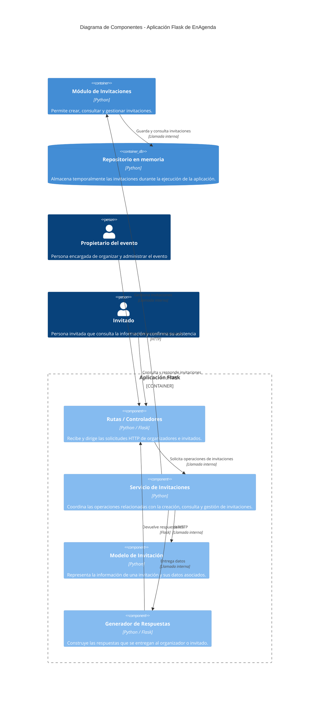

# C4 - Nivel 3: Componentes

```mermaid
C4Component
    title Diagrama de Componentes - Aplicación Flask de EnAgenda

    Container_Boundary(webApp, "Aplicación Flask") {

        Component(rutas, "Rutas / Controladores", "Python / Flask", "Recibe y dirige las solicitudes HTTP de organizadores e invitados.")

        Component(servicioInvitaciones, "Servicio de Invitaciones", "Python", "Coordina las operaciones relacionadas con la creación, consulta y gestión de invitaciones.")

        Component(modeloInvitacion, "Modelo de Invitación", "Python", "Representa la información de una invitación y sus datos asociados.")

        Component(respuesta, "Generador de Respuestas", "Python / Flask", "Construye las respuestas que se entregan al organizador o invitado.")
    }

    Container(invitaciones, "Módulo de Invitaciones", "Python", "Permite crear, consultar y gestionar invitaciones.")

    ContainerDb(repositorio, "Repositorio en memoria", "Python", "Almacena temporalmente las invitaciones durante la ejecución de la aplicación.")

    Person(organizador, "Propietario del evento", "Persona encargada de organizar y administrar el evento")
    Person(invitado, "Invitado", "Persona invitada que consulta la información y confirma su asistencia")

    Rel(organizador, rutas, "Crea y administra invitaciones", "HTTP")
    Rel(invitado, rutas, "Consulta y responde invitaciones", "HTTP")

    Rel(rutas, servicioInvitaciones, "Solicita operaciones de invitaciones", "Llamada interna")
    Rel(servicioInvitaciones, modeloInvitacion, "Utiliza", "Llamada interna")
    Rel(servicioInvitaciones, invitaciones, "Gestiona invitaciones", "Llamada interna")
    Rel(invitaciones, repositorio, "Guarda y consulta invitaciones", "Llamada interna")
    Rel(servicioInvitaciones, respuesta, "Entrega datos", "Llamada interna")
    Rel(respuesta, rutas, "Devuelve respuesta HTTP", "Flask")
```

