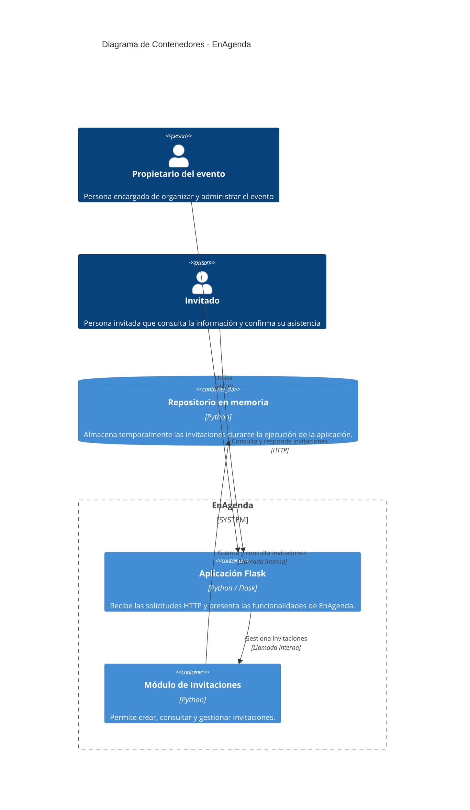

# Documento de correcciones al feedback

**Proyecto:** EnAgenda — Arquitectura de Software (AS_202620)
**Corte:** Corte 1
**Fecha:** 6 de septiembre de 2026

---

## 1. Propósito del documento

Este documento registra las correcciones realizadas sobre los hallazgos señalados en las retroalimentaciones de las semanas anteriores y, especialmente, los ajustes realizados para el cierre del primer corte.

El objetivo es dejar constancia de las correcciones efectuadas sobre los artefactos de arquitectura y su trazabilidad con la implementación actual del proyecto.

Las modificaciones descritas en este documento corresponden únicamente a elementos que fueron señalados explícitamente en el feedback y que fueron corregidos en el repositorio.

No se agregan nuevos retos, funcionalidades, mediciones o decisiones arquitectónicas que no formen parte de la implementación actual.

---

# 2. Correcciones realizadas a partir del feedback

## 2.1. Corrección de los diagramas C4

### Hallazgo

En la retroalimentación de la semana 4 se indicó que el diagrama C4 de contenedores no era coherente con la implementación real.

El feedback señalaba que el diagrama mostraba una separación entre API/Backend y Base de Datos, mientras que la implementación correspondía a una aplicación Flask con un repositorio en memoria.

También se indicó para el primer corte que el C4 de contenedores debía alinearse con el monolito Flask y la persistencia en memoria existentes.

### Corrección realizada

Se actualizaron los diagramas C4 para representar la arquitectura que actualmente existe en el código.

En el nivel de contenedores se reemplazaron elementos que no correspondían directamente con la implementación actual:

* **Aplicación Web** → **Aplicación Flask**
* **API / Backend** → **Módulo de Invitaciones**
* **Base de Datos** → **Repositorio en memoria**

Se conservaron los actores del sistema:

* **Propietario del evento**
* **Invitado**

De esta manera, el diagrama representa la interacción real entre los usuarios, la aplicación Flask, el módulo de invitaciones y el repositorio utilizado durante la ejecución.

### C4 Nivel 2 actualizado



El cambio permite que el C4 describa la estructura que puede ser comprobada directamente en el código y evita representar componentes que no existen en la implementación actual.

---

# 3. Corrección de la trazabilidad en `docs/aspectos.md`

## Hallazgo

El feedback señaló que la tabla de aspectos mantenía elementos como C4, código, pruebas y evidencia sin destinos navegables.

Para el primer corte se solicitó completar la fila de aspectos hasta código, prueba y evidencia.

## Corrección realizada

Se actualizó `docs/aspectos.md` para convertir las referencias en enlaces navegables hacia los artefactos correspondientes del repositorio.

La fila de Gestión de Invitaciones queda relacionada con:

* Los diagramas C4 correspondientes.
* El código de la funcionalidad de invitaciones.
* Las pruebas automatizadas.
* El documento que registra las correcciones realizadas.

La trazabilidad permite pasar desde el aspecto hasta los artefactos que permiten comprobar su implementación.

### Matriz actualizada

```markdown
# Aspectos

| ID | Aspecto | Requisito | C4 | ADR | Código | Pruebas | Evidencia |
|---|---|---|---|---|---|---|---|
| A-01 | Gestión de Invitaciones | El sistema debe permitir al propietario generar un enlace individual para cada invitado, mediante el cual el invitado pueda consultar la información pública del evento y registrar su respuesta de asistencia. | [C4 Nivel 1](c4/nivel-1-contexto.md)<br>[C4 Nivel 2](c4/nivel-2-contenedores.md) | [ADR-0001](adr/0001-usar-monolito-modular.md) | [Módulo de invitaciones](../src/invitaciones/)<br>[Aplicación](../app/web.py) | [Pruebas de invitaciones](../tests/test_invitaciones.py) | [Correcciones al feedback](correcciones-feedback.md) |
```

Con esto se corrige específicamente el problema señalado en la revisión: la información deja de aparecer como `Pendiente` o como texto sin destino y pasa a tener referencias directas dentro del repositorio.

---

# 4. Correspondencia entre C4 y código

La corrección del C4 se realizó tomando como referencia la implementación existente.

La estructura actualmente representada corresponde a:

```text
EnAgenda
│
├── Aplicación Flask
│   └── app/web.py
│
├── Módulo de Invitaciones
│   ├── src/invitaciones/aplicacion/
│   ├── src/invitaciones/dominio/
│   └── src/invitaciones/infraestructura/
│
└── Repositorio en memoria
    └── src/invitaciones/infraestructura/repositorio_memoria.py
```

La funcionalidad se encuentra respaldada por las pruebas:

```text
tests/test_invitaciones.py
```

Por lo tanto, el C4 actualizado representa los elementos que pueden ser identificados en la implementación actual.

---

# 5. Respuesta al hallazgo del primer corte

El feedback de la semana 5 indicó que la línea base de invitaciones cuenta con aplicación, pruebas y CI en verde, pero también señaló como pendientes la identificación de un reto nuevo, una restricción, una medición inicial, un ADR nuevo, un incremento y una comparación contra un umbral.

Para este corte no se incorpora una nueva funcionalidad ni se formula un reto diferente al trabajo existente.

El trabajo realizado para responder al feedback se concentra en las correcciones arquitectónicas y de trazabilidad que sí fueron identificadas como necesarias:

1. Alinear el C4 de contenedores con la implementación real.
2. Representar correctamente la aplicación Flask.
3. Representar el módulo de invitaciones existente.
4. Representar el repositorio en memoria utilizado actualmente.
5. Mantener los actores Propietario del evento e Invitado.
6. Completar la trazabilidad de `docs/aspectos.md`.
7. Enlazar C4, código, pruebas y evidencia desde la matriz de aspectos.
8. Documentar estas correcciones para que puedan ser verificadas directamente en el repositorio.

No se declara como implementado ningún elemento que no exista actualmente en el proyecto.

---

# 6. Evidencia de la corrección

La evidencia de los cambios realizados se encuentra en los siguientes artefactos del repositorio:

| Elemento                  | Evidencia                                                 |
| ------------------------- | --------------------------------------------------------- |
| C4 Nivel 1                | `docs/c4/nivel-1-contexto.md`                             |
| C4 Nivel 2                | `docs/c4/nivel-2-contenedores.md`                         |
| Aplicación                | `app/web.py`                                              |
| Módulo de Invitaciones    | `src/invitaciones/`                                       |
| Repositorio en memoria    | `src/invitaciones/infraestructura/repositorio_memoria.py` |
| Pruebas                   | `tests/test_invitaciones.py`                              |
| Matriz de aspectos        | `docs/aspectos.md`                                        |
| Documento de correcciones | `docs/correcciones-feedback.md`                           |

---

# 7. Resultado

Con las correcciones realizadas, los diagramas C4 fueron ajustados para que correspondan con la arquitectura actualmente implementada.

La matriz de aspectos también fue actualizada para permitir una navegación directa hacia los diagramas, el código, las pruebas y la evidencia documental.

De esta forma, los elementos corregidos a partir del feedback quedan documentados y pueden ser verificados directamente en el repositorio.

El alcance de este documento se limita a las correcciones efectivamente realizadas y no incorpora funcionalidades, retos o decisiones que no formen parte del estado actual del proyecto.

---

# 8. Cierre del Corte 1

Para el cierre del primer corte se deja como evidencia la versión corregida de los artefactos de arquitectura y su correspondencia con la implementación actual.

Los cambios principales realizados fueron:

* Corrección del C4.
* Alineación del C4 con Flask y el repositorio en memoria.
* Conservación de los actores del sistema.
* Actualización de la matriz de aspectos.
* Incorporación de referencias navegables hacia C4, código, pruebas y evidencia.
* Documentación de las correcciones realizadas a partir del feedback.

Estos cambios permiten que la arquitectura documentada pueda ser contrastada directamente con el código existente.
